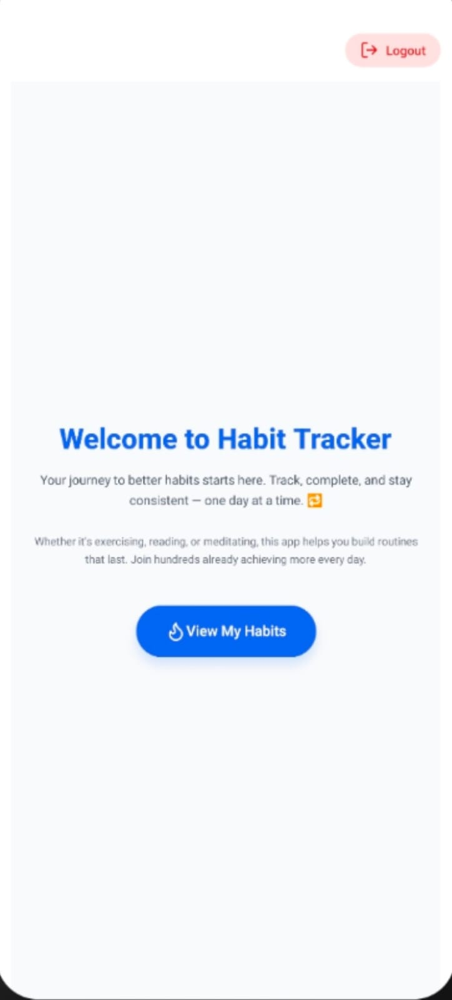
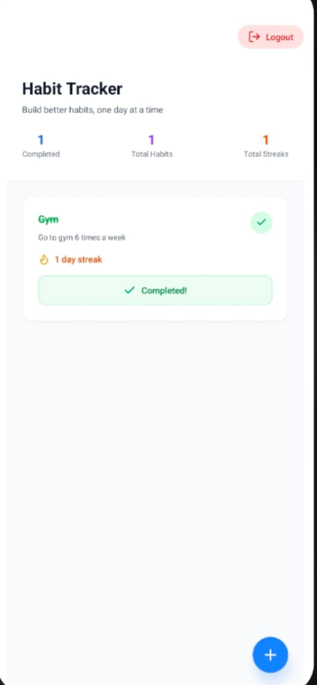
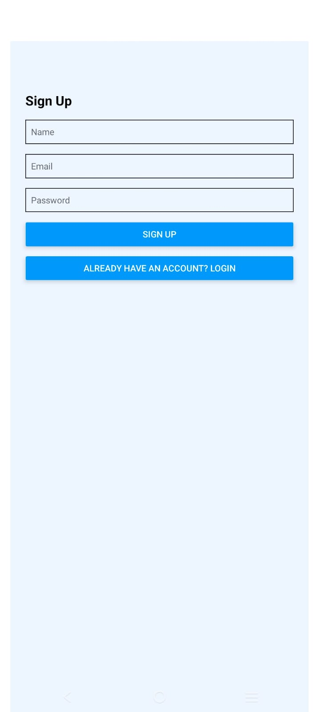

# 📱 Habit Tracker App

Track your daily habits, build consistency, and achieve your goals — one day at a time.


## 🔗 Live Demo

📲 Open the app on your phone using [Expo Go](https://expo.dev/go):

👉 **[https://expo.dev/@csiddhardha/frontend](https://expo.dev/preview/update?message=third%20publish&updateRuntimeVersion=1.0.0&createdAt=2025-06-25T13%3A46%3A54.684Z&slug=exp&projectId=ab0970e0-dbba-4e1a-af98-062726287124&group=0e9a76e0-4724-4534-8269-4bb97710febc)**  
(Scan the QR code on that page using Expo Go or just scan below)

---

## 🧠 Features

- ✅ Sign up / Login with secure token storage
- 📆 Create habits with title, description, and daily frequency
- 🔁 Track completion for each habit daily
- 🔥 View habit streaks and completion count
- 📊 Intuitive dashboard with real-time stats

---

## 🛠 Tech Stack

### Frontend
- **React Native** (with [Expo](https://expo.dev/))
- **Tailwind CSS** via `nativewind`
- **Lucide-react-native** (icons)
- **Expo Router** for navigation
- **SecureStore** for token storage

### Backend (Optional for Fullstack)
- Node.js + Express
- MongoDB (Mongoose)
- JWT Authentication
- REST API

---

## 📸 Screenshots

| Home | Habits List | Sign Up |
|------|-------------|-----------|
|  |  |  |

---

## 🚀 Getting Started Locally

### Prerequisites

- Node.js & npm
- Expo CLI (`npm install -g expo-cli`)
- Android/iOS device or emulator

### Run Frontend

```bash
git clone https://github.com/yourusername/habit-tracker.git
cd habit-tracker/frontend
npm install
npx expo start

```

## Run Backend

```bash
git clone https://github.com/yourusername/habit-tracker.git
cd habit-tracker/backend
npm install
create .env in backend folder
add your MONGO_URI and JWT_SECRET variables in backend/.env
node server.js
